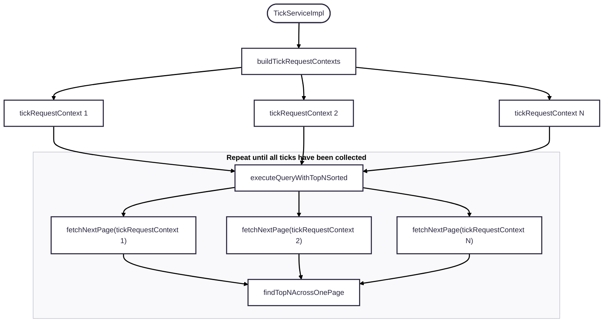

# tick-reader

A Spring Boot application that queries tick data from Cosmos DB with advanced filtering and projection capabilities.

## Features

- **Multi-RIC Query Support**: Query tick data for multiple RICs simultaneously
- **Advanced Filtering**: Support for range filters, price-volume filters, and string-based qualifiers filters
- **Field Projections**: Select specific fields to reduce response payload size
- **Parallel Processing**: Efficient parallel execution across multiple Cosmos DB containers
- **Diagnostics**: Built-in query execution diagnostics and performance monitoring
- **Pagination**: Internal pagination for large result sets

## Configuration

### System Properties and Environment Variables

| System Property Name           | Environment Variable Name      | Default Value | Possible Value                     | Description                                                                                                                                                                               |
|--------------------------------|--------------------------------|---------------|------------------------------------|-------------------------------------------------------------------------------------------------------------------------------------------------------------------------------------------|
| COSMOS.CONNECTION_MODE         | COSMOS_CONNECTION_MODE         | LOW           | `GATEWAY`                          | The connection mode which should be used when connecting to Cosmos DB. The possible values are `GATEWAY` (default) or `DIRECT`. The default value should be sufficient for this workload. |                                                                                                                                                                                                                                                                                                                                                                                                                                                                                                                                                                                                                                 |
| COSMOS.AAD_MANAGED_IDENTITY_ID | COSMOS_AAD_MANAGED_IDENTITY_ID | HIGH          | Auto-Discovery                     | The client-id of the managed identity to be used - if not specified picks one based on DefaultAzureCredential logic - if specified, it will always use that identity.                     |                                                                                                                                                                                                                                                                                                                                                                                                                                                                                                                                                                                                                                |
| COSMOS.AAD_TENANT_ID           | COSMOS_AAD_TENANT_ID           | HIGH          | Auto-Discovery                     | The AAD tenant id for the Azure resources and identities.                                                                                                                                 |                                                                                                                                                                                                                                                                                                                                                                                                                                                                                                                                                                                                                               |
| COSMOS.AAD_LOGIN_ENDPOINT      | COSMOS_AAD_LOGIN_ENDPOINT      | LOW           | https://login.microsoftonline.com/ | Only needs to be modified in non-public Azure clouds.                                                                                                                                     |                                                                                                                                                                                                                                                                                                                                                                                                                                                                                                                                                                                                                              |

### application.yml

Configure accounts and database names for Cosmos DB in `application.yml`:

An example configuration for two Cosmos DB accounts (count can vary) with different database names and URIs:

```yaml
ticks:
  cosmosDbAccounts:
    1: 
      databaseName: ${DATABASE_NAME_HASH_1}
      accountUri: ${COSMOSDB_ACCOUNT_URI_HASH_1}
      containerNamePrefix: "container_"
      containerNameFormat: "yyyyMMdd"
      containerNameSuffix: "y"
      hashId: 1
      commaSeparatedPreferredRegions: ${COSMOSDB_PREFERRED_REGIONS_HASH_1}
    2:
      databaseName: ${DATABASE_NAME_HASH_2}
      accountUri: ${COSMOSDB_ACCOUNT_URI_HASH_2}
      containerNamePrefix: "container_"
      containerNameFormat: "yyyyMMdd"
      containerNameSuffix: "y"
      hashId: 2
      commaSeparatedPreferredRegions: ${COSMOSDB_PREFERRED_REGIONS_HASH_2}
  shardCountPerRic: 8
  implementation: "completeablefuture"
```

**Configuration Parameters:**
- `DATABASE_NAME_HASH_1`, `DATABASE_NAME_HASH_2`: The names of the databases in the respective Cosmos DB accounts.
- `COSMOSDB_ACCOUNT_URI_HASH_1`, `COSMOSDB_ACCOUNT_URI_HASH_2`: The URIs of the respective Cosmos DB accounts.
- `COSMOSDB_PREFERRED_REGIONS_HASH_1`, `COSMOSDB_PREFERRED_REGIONS_HASH_2`: Comma-separated preferred regions for each Cosmos DB account (E.g: "East US 2, West US"). Depending on this setting, `CosmosClient` will reach out to the container in that region order.
- **NOTE:** The `hashId` and the outer number are to be kept the same.

## Container Setup

- Ensure that the Cosmos DB containers are set up with the name `container_<date><suffix>` where `<date>` is in the format `yyyyMMdd` and the `<suffix>` is `y`. For example, for the date `2024-10-08`, the container name would be `container_20241008y`.
- Ensure that the containers are partitioned by `pk` (partition key) and composite indexed on `messageTimestamp` and `recordKey` for efficient sorting based on both these properties.

### Composite Index Setup

```json
{
  "indexingMode": "consistent",
  "automatic": true,
  "includedPaths": [
    {
      "path": "/*"
    }
  ],
  "excludedPaths": [
    {
      "path": "/\"_etag\"/?"
    }
  ],
  "compositeIndexes": [
    [
      {
        "path": "/pk",
        "order": "ascending"
      },
      {
        "path": "/messageTimestamp",
        "order": "descending"
      }
    ],
    [
      {
        "path": "/pk",
        "order": "ascending"
      },
      {
        "path": "/messageTimestamp",
        "order": "ascending"
      }
    ]
  ],
  "fullTextIndexes": []
}
```

## API Endpoints

### 1. Basic Tick Query with Projections

**Endpoint:** `GET /ticks/sort=messageTimestamp`

**Description:** Retrieves tick data with optional field projections to reduce response payload size.

**Parameters:**

| Parameter           | Description                                                                                                        | Required | Default Value | Example Value                  |
|---------------------|--------------------------------------------------------------------------------------------------------------------|----------|---------------|--------------------------------|
| `rics`              | Comma-separated list of RICs to query.                                                                             | Yes      | N/A           | `AAPL,MSFT,GOOGL`              |
| `docTypes`          | Comma-separated list of document types to query.                                                                   | Yes      | N/A           | `TAS,TAQ`                      |
| `totalTicks`        | Total number of ticks to return.                                                                                   | Yes      | N/A           | `5000`                         |
| `pinStart`          | Whether to pin the start time for the query. If true, the start time will be pinned to the beginning of the day.   | Yes      | N/A           | `true`                         |
| `startTime`         | Start time for the query in ISO 8601 format.                                                                       | Yes      | N/A           | `2024-10-07T00:00:00.0000000Z` |
| `endTime`           | End time for the query in ISO 8601 format.                                                                         | Yes      | N/A           | `2024-10-07T23:59:59.9999999Z` |
| `includeNullValues` | Whether to include ticks with null values in the response.                                                         | No       | `false`       | `true`                         |
| `pageSize`          | Number of ticks to return per query which the CosmosClient internally executes.                                    | No       | `100`         | `1000`                         |
| `includeDiagnostics`| Whether to include query execution diagnostics in the response.                                                    | No       | `false`       | `true`                         |
| `projections`       | Comma-separated list of field names to include in the response. Core fields (id, ricName, messageTimestamp, pk) are always included. | No | All fields | `TRDPRC_1,TRDVOL_1,BID,ASK` |

**Example Request:**
```http
GET /ticks/sort=messageTimestamp?rics=MSFT,AAPL,GOOGL&docTypes=TAS&totalTicks=10000&pinStart=true&startTime=2024-10-07T00:00:00.0000000Z&endTime=2024-10-07T23:59:59.9999999Z&pageSize=50&includeNullValues=true&projections=TRDPRC_1,TRDVOL_1,BID,ASK
```

### 2. Tick Query with Range Filters

**Endpoint:** `GET /ticks/with-range-filters`

**Description:** Retrieves tick data with optional range filters on `TRDPRC_1` and `TRNOVR_UNS` fields.

**Additional Parameters:**

| Parameter           | Description                                                                                                        | Required | Default Value | Example Value                  |
|---------------------|--------------------------------------------------------------------------------------------------------------------|----------|---------------|--------------------------------|
| `trdprc1Min`        | Minimum value for TRDPRC_1 field.                                                                                  | No       | N/A           | `100.0`                        |
| `trdprc1Max`        | Maximum value for TRDPRC_1 field.                                                                                  | No       | N/A           | `200.0`                        |
| `trnovrUnsMin`      | Minimum value for TRNOVR_UNS field.                                                                                | No       | N/A           | `1000000.0`                    |
| `trnovrUnsMax`      | Maximum value for TRNOVR_UNS field.                                                                                | No       | N/A           | `5000000.0`                    |

**Example Request:**
```http
GET http://localhost:8080/ticks/with-range-filters?rics=MSFT,AAPL,EUR=,NFLX,NVDA,GOOGL,AMZN,TSLA,META,BRK.A&docTypes=TAS,TAQ&totalTicks=50&pinStart=true&startTime=2024-10-07T00:00:00.0000000Z&endTime=2024-10-07T23:59:59.9999999Z&trdprc1Min=100.0&trdprc1Max=20000.0&trnovrUnsMin=500.0&trnovrUnsMax=50010.0&projections=TRDPRC_1,TRNOVR_UNS
```

### 3. Tick Query with Price-Volume Filters

**Endpoint:** `GET /ticks/with-price-volume-filters`

**Description:** Retrieves tick data with filters on `TRDPRC_1` (between two values) and `TRDVOL_1` (greater than or equal to a value).

**Additional Parameters:**

| Parameter           | Description                                                                                                        | Required | Default Value | Example Value                  |
|---------------------|--------------------------------------------------------------------------------------------------------------------|----------|---------------|--------------------------------|
| `trdprc1Min`        | Minimum value for TRDPRC_1 field.                                                                                  | No       | N/A           | `100.0`                        |
| `trdprc1Max`        | Maximum value for TRDPRC_1 field.                                                                                  | No       | N/A           | `200.0`                        |
| `trdvol1Min`        | Minimum value for TRDVOL_1 field (greater than or equal).                                                         | No       | N/A           | `1000.0`                       |

**Example Request:**
```http
GET http://localhost:8080/ticks/with-price-volume-filters?rics=MSFT,AAPL&docTypes=TAS&totalTicks=5000&pinStart=true&startTime=2024-10-07T00:00:00.0000000Z&endTime=2024-10-07T23:59:59.9999999Z&trdprc1Min=100.0&trdprc1Max=200.0&trdvol1Min=1000.0&projections=TRDPRC_1,TRDVOL_1
```

### 4. Tick Query with Qualifiers Filters

**Endpoint:** `GET /ticks/with-qualifiers-filters`

**Description:** Retrieves tick data with complex string filters on the `qualifiers` property using Cosmos DB string functions.

**Additional Parameters:**

| Parameter           | Description                                                                                                        | Required | Default Value | Example Value                  |
|---------------------|--------------------------------------------------------------------------------------------------------------------|----------|---------------|--------------------------------|
| `containsFilters`   | Comma-separated list of strings that must be contained in the qualifiers field.                                    | No       | N/A           | `"ACTIVE","LIQUID"`            |
| `notContainsFilters`| Comma-separated list of strings that must NOT be contained in the qualifiers field.                               | No       | N/A           | `"HALTED","SUSPENDED"`         |
| `startsWithFilters` | Comma-separated list of strings that the qualifiers field must start with.                                        | No       | N/A           | `"ACTIVE"`                     |
| `notStartsWithFilters`| Comma-separated list of strings that the qualifiers field must NOT start with.                                   | No       | N/A           | `"INACTIVE"`                   |

**Example Request:**
```http
GET http://localhost:8080/ticks/with-qualifiers-filters?rics=MSFT,AAPL&docTypes=TAS&totalTicks=5000&pinStart=true&startTime=2024-10-07T00:00:00.0000000Z&endTime=2024-10-07T23:59:59.9999999Z&containsFilters=ASK_TONE&notContainsFilters=IT&projections=qualifiers,TRDPRC_1
```

## Response Format

All endpoints return the same response format:

```json
{
  "ticks": [
    {
      "id": "b1d19bdb-dc8b-47db-a2ab-e46827e66fbd",
      "pk": "AAPL|20241008|6",
      "ricName": "AAPL",
      "messageTimestamp": 1728375596311321505,
      "executionTime": 8504,
      "recordKey": 574062,
      "TRDPRC_1": 150.25,
      "TRDVOL_1": 1000000.0,
      "BID": 150.20,
      "ASK": 150.30,
      "qualifiers": "ACTIVE,LIQUID"
    }
  ],
  "diagnosticsList": ["..."],
  "executionTime": "PT0.8935116S"
}
```

## Complete Tick POJO Structure

The `Tick` entity contains the following fields:

### Core Fields (Always Included)
- `id` (String): Unique identifier
- `pk` (String): Partition key
- `ricName` (String): RIC name
- `messageTimestamp` (Long): Message timestamp

### Trading Fields
- `TRDPRC_1` (Double): Trade price
- `TRDVOL_1` (Double): Trade volume
- `TRNOVR_UNS` (Double): Turnover
- `BID` (Double): Bid price
- `BIDSIZE` (Double): Bid size
- `ASK` (Double): Ask price
- `ASKSIZE` (Double): Ask size
- `MID_PRICE` (Double): Mid price
- `VWAP` (Double): Volume weighted average price

### Market Data Fields
- `OPEN_PRC` (Double): Open price
- `HIGH_1` (Double): High price
- `LOW_1` (Double): Low price
- `YIELD` (Double): Yield
- `DURATION` (Double): Duration
- `CONVEXITY` (Double): Convexity
- `DELTA` (Double): Delta
- `GAMMA` (Double): Gamma
- `THETA` (Double): Theta
- `VEGA` (Double): Vega
- `RHO` (Double): Rho

### Fixed Income Fields
- `BID_YIELD` (Double): Bid yield
- `ASK_YIELD` (Double): Ask yield
- `MID_YLD_1` (Double): Mid yield
- `OAS` (Double): Option adjusted spread
- `ZSPREAD` (Double): Z-spread
- `BMK_SPD` (Double): Benchmark spread
- `CDS_BASIS` (Double): CDS basis
- `SWAP_SPRD` (Double): Swap spread

### Volume and Turnover Fields
- `ACVOL_1` (Double): Accumulated volume
- `TOT_VOLUME` (Long): Total volume
- `BLKVOLUM` (Long): Block volume
- `VOLUME_ADV` (Long): Volume advancing
- `VOLUME_DEC` (Long): Volume declining
- `VOLUME_UNC` (Long): Volume unchanged

### Metadata Fields
- `executionTime` (Long): Execution time
- `msgSequence` (Integer): Message sequence
- `RecordKey` (Long): Record key
- `COLLECT_DATETIME` (Long): Collection datetime
- `SOURCE_DATETIME` (Long): Source datetime
- `ChangeTimeStamp` (Long): Change timestamp
- `SEQNUM` (String): Sequence number
- `TRDXID_1` (String): Trade exchange ID
- `TRADE_ID` (String): Trade ID

### Qualifiers and User Fields
- `qualifiers` (String): Qualifiers string
- `user_qualifiers` (String): User qualifiers

### Additional Trading Fields
- `PRCTCK_1` (String): Price tick
- `BID_TICK_1` (String): Bid tick
- `TRD_STATUS` (String): Trade status
- `HALT_RSN` (String): Halt reason
- `TRD_RIC` (String): Trade RIC
- `MMT_CLASS` (String): MMT class
- `INST_DESC` (String): Instrument description

### Performance and Analytics Fields
- `NETCHNG_1` (Double): Net change
- `PCTCHNG` (Double): Percentage change
- `FAIR_VALUE` (Double): Fair value
- `THEO_PRC` (Double): Theoretical price
- `IMP_VOLT` (Double): Implied volatility
- `IMP_YIELD` (Double): Implied yield

### Time Series Fields
- `messageTimestamp_st` (String): Message timestamp string
- `messageTimestamp_dt` (LocalDateTime): Message timestamp datetime
- `messageTimestamp_ns` (Integer): Message timestamp nanoseconds
- `executionTime_st` (String): Execution time string
- `executionTime_dt` (LocalDateTime): Execution time datetime
- `executionTime_ns` (Integer): Execution time nanoseconds

### Additional Fields
The complete Tick entity contains over 400 fields covering various aspects of financial market data including:
- Bond-specific fields (coupon rates, maturity dates, etc.)
- Option-specific fields (strike prices, expiration dates, etc.)
- Currency and exchange rate fields
- Economic indicator fields
- Technical analysis fields
- Risk management fields

For the complete list of all available fields, refer to the `Tick.java` entity class.

## Running the Application

### Setting up the environment

- Ensure you have Java 17 or higher installed.
  - https://learn.microsoft.com/en-us/java/openjdk/download
  - https://learn.microsoft.com/en-us/java/openjdk/install
- Ensure you have Maven installed.
  - https://maven.apache.org/install.html

### AAD Setup

- To assign the data-plane access to the identity of the application, follow the steps in the Azure documentation:
  - https://learn.microsoft.com/en-us/azure/cosmos-db/nosql/how-to-grant-data-plane-access?tabs=built-in-definition%2Ccsharp&pivots=azure-interface-cli
  - The `tick-reader` application uses `DefaultAzureCredential` to authenticate with Azure Cosmos DB, which supports managed identities, environment variables, and other authentication methods. This will do an auto-discovery of the managed identity if not specified.

- Below is a sample command to assign the `Cosmos DB Built-in Data Contributor` role to the managed identity of the application:

```bash
az cosmosdb sql role assignment create --resource-group "<resource-group>" --account-name "<cosmos-db-account-name>" --role-definition-id "00000000-0000-0000-0000-000000000002" --principal-id "<service-principal-id>" --scope "" --subscription "<subscription>"        
```

### Building the application into an executable JAR

```bash
mvn clean package
```

### Running the application

```bash
java "-DCOSMOS.SWITCH_OFF_IO_THREAD_FOR_RESPONSE=true" -jar target/tick-reader-app.jar
```

## Code Flow

The code flow of the application is as follows:



### Description of the flow

- The `TickServiceImpl` encapsulates the implementation details for querying tick data.
- First, it builds a list of `TickRequestContextPerPartitionKey` objects.
- `TickRequestContextPerPartitionKey` is a data structure that holds the necessary metadata for querying ticks associated with a `<RIC|day|shard>` against a particular `CosmosContainer` instance. It stores the continuation (to fetch the next page) and a list of `CosmosDiagnosticsContext` to collect diagnostics information for each query execution.
- Each `TickRequestContext` is responsible for executing the query against the Cosmos DB container.
- The `findTopNAcrossOnePage` method is called to find the top N ticks across all pages fetched for each `TickRequestContextPerPartitionKey`. It uses a priority queue to efficiently maintain the top N ticks across all pages spanning an iteration (1 execution across all `fetchNextPage`).
- The series of `fetchNextPage` followed by `findTopNAcrossOnePage` is repeatedly executed until required count of ticks have been collected or each query executed (per `TickRequestContextPerPartitionKey`) has been drained completely.

## Security Considerations

- **Field Validation**: All projection fields are validated against a whitelist to prevent SQL injection
- **Parameter Binding**: All query parameters are properly bound to prevent injection attacks
- **Authentication**: Uses Azure AD managed identity for secure authentication
- **Authorization**: Requires appropriate Cosmos DB data plane permissions

## Performance Considerations

- **Parallel Processing**: Queries are executed in parallel across multiple containers
- **Pagination**: Internal pagination reduces memory usage for large result sets
- **Projections**: Field projections reduce network bandwidth and processing time
- **Indexing**: Proper composite indexes ensure efficient query execution
- **Connection Pooling**: Efficient connection management for Cosmos DB clients
