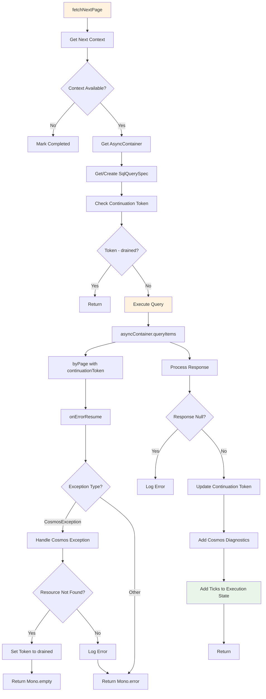
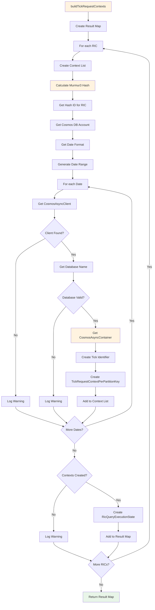
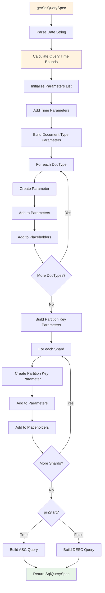
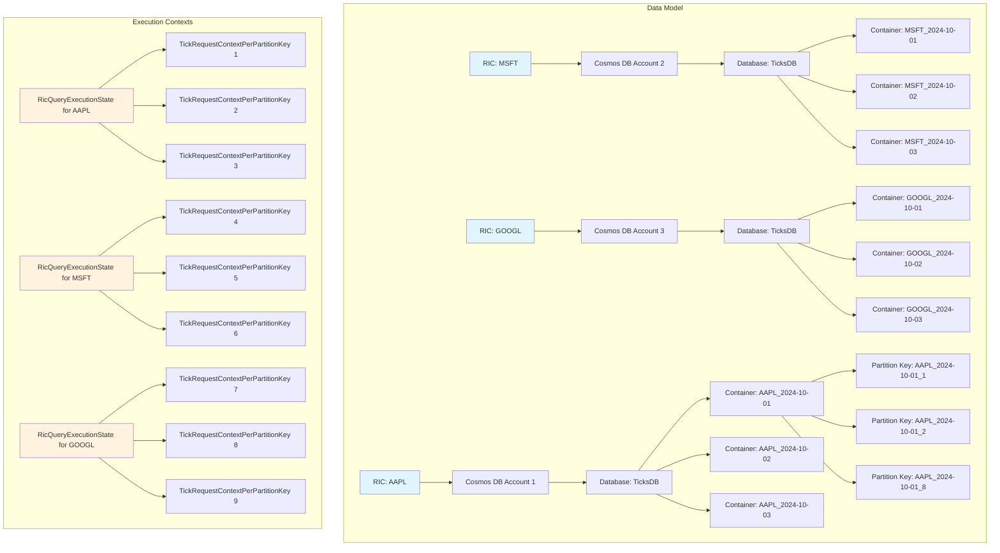
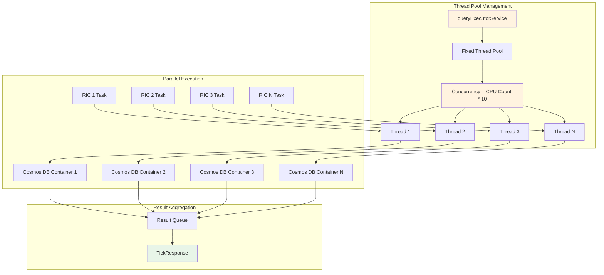
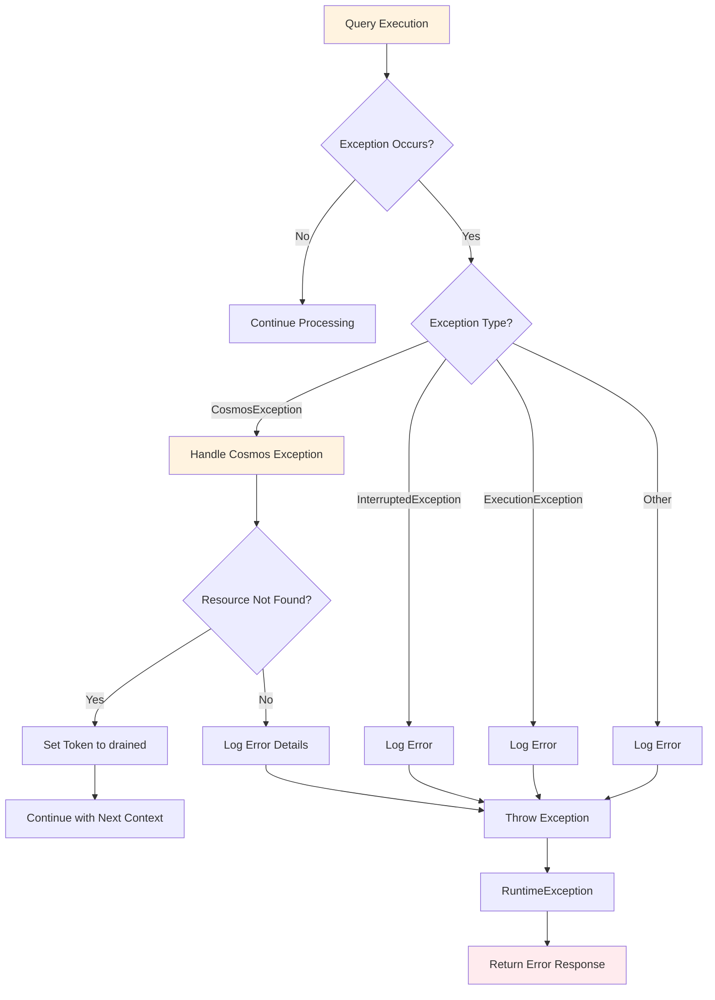
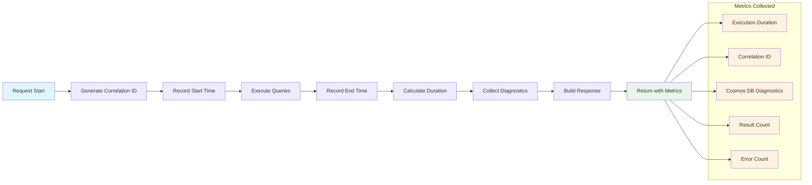

# TickServiceImpl Code Flow Diagram

## Overview
This diagram illustrates the complete code flow in `TickServiceImpl`, showing the asynchronous processing, parallel execution, and data retrieval patterns.

## Main Flow Diagram

```mermaid
flowchart TD
    A[TicksController.getTicks] --> B[TickServiceImpl.getTicks]
    B --> C{Synchronous Wrapper}
    C --> D[getTicksAsync]
    
    D --> E[CompletableFuture.supplyAsync]
    E --> F[Normalize Time Range]
    F --> G[buildTickRequestContexts]
    
    G --> H[For each RIC]
    H --> I[Calculate Murmur3 Hash]
    I --> J[Determine Cosmos DB Account]
    J --> K[Generate Date Range]
    K --> L[For each Date]
    L --> M[Get CosmosAsyncClient]
    M --> N[Get CosmosAsyncContainer]
    N --> O[Create TickRequestContextPerPartitionKey]
    O --> P[Add to tickRequestContexts]
    P --> Q{More Dates?}
    Q -->|Yes| L
    Q -->|No| R[Create RicQueryExecutionState]
    R --> S{More RICs?}
    S -->|Yes| H
    S -->|No| T[executeQueryWithTopNSorted]
    
    T --> U[Record Start Time]
    U --> V[Create Diagnostics List]
    V --> W[While Not All Completed]
    W --> X[Create Parallel Tasks]
    X --> Y[For each RicQueryExecutionState]
    Y --> Z[fetchNextPage]
    Z --> AA[Wait for All Tasks]
    AA --> BB{All Completed?}
    BB -->|No| W
    BB -->|Yes| CC[Record End Time]
    
    CC --> DD[Aggregate Results]
    DD --> EE[For each RIC]
    EE --> FF[Get RicQueryExecutionState]
    FF --> GG[Get Ticks]
    GG --> HH[Collect Diagnostics]
    HH --> II[Apply Sorting if pinStart]
    II --> JJ[Add to resultTicks]
    JJ --> KK{More RICs?}
    KK -->|Yes| EE
    KK -->|No| LL[Convert Response Format]
    
    LL --> MM{includeNullValues?}
    MM -->|Yes| NN[Use Original Ticks]
    MM -->|No| OO[Convert to TickWithNoNulls]
    OO --> PP[Create TickResponse]
    NN --> PP
    PP --> QQ[Return Response]
    
    style A fill:#e1f5fe
    style B fill:#e1f5fe
    style T fill:#fff3e0
    style Z fill:#fff3e0
    style PP fill:#e8f5e8
    style QQ fill:#e8f5e8
```

## Page Fetching Flow

## Context Building Flow

## SQL Query Building Flow

## Data Model Architecture

## Concurrency and Threading Model

## Error Handling Flow

## Performance Metrics Flow

## Key Design Patterns Illustrated

1. **Asynchronous Processing**: CompletableFuture for non-blocking operations
2. **Parallel Execution**: Concurrent tasks across multiple RICs and containers
3. **Pagination Strategy**: Continuation token-based page fetching
4. **Error Handling**: Graceful exception handling with fallback strategies
5. **Resource Management**: Thread pool management and connection handling
6. **Performance Monitoring**: Execution time tracking and diagnostics collection
7. **Data Partitioning**: RIC-based account distribution and date-based containers
8. **State Management**: Execution state tracking across multiple contexts

These diagrams provide a comprehensive view of the complex asynchronous, parallel processing architecture implemented in `TickServiceImpl`. 