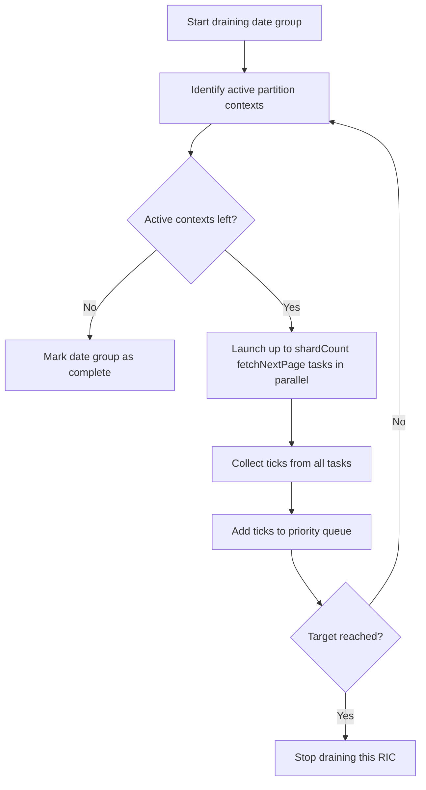
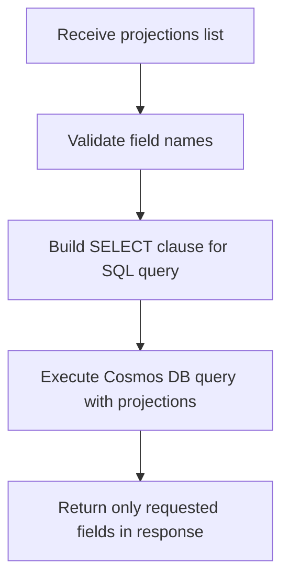

# Projections Filter & Parallelization Logic for getTicks* Variants

This document describes the projections filter implementation and parallelization logic for all `getTicks*` variants in `TickServiceImpl`. It covers the high-level flow, parallelization strategy, projections handling, and includes relevant code and diagrams for clarity.

---

## 1. High-Level Code Flow

1. **Request Handling**
   - Controller receives a request (with projections, filters, etc.).
   - Calls the corresponding `getTicks*` method in `TickServiceImpl`.

2. **Async Orchestration**
   - Each `getTicks*` method wraps an async variant (e.g., `getTicksWithRangeFiltersAsync`).
   - The async method:
     1. **Normalizes** the time range.
     2. **Builds execution contexts** for each RIC, partitioned by date and Cosmos DB shard.
     3. **Creates a RicQueryExecutionState** (per RIC) containing a list of RicQueryExecutionStateByDate (per date).
     4. **For each RIC**: executes a **sequential draining strategy**:
        - For each date group (sequentially):
          - Drains up to `shardCount` partition contexts in parallel, using a fetch function (e.g., `fetchNextPageWithRangeFilters`).
          - Adds ticks to a priority queue (sorted by timestamp, capped at total tick count).
          - Moves to the next date group if the target is not reached.
     5. **Aggregates results** from all RICs, applies projections, and returns the response.

3. **Projections**
   - The `projections` parameter is used to build the SQL SELECT clause for Cosmos DB queries.
   - Only the requested fields (plus required core fields) are returned.

---

## 2. Parallelization and Draining Strategy

- **Within a date group**: Partition key contexts are drained in parallel (up to `shardCount`).
- **Across date groups**: Draining is sequential (one date group at a time).
- **Across RICs**: Each RIC is processed independently (can be parallelized at the RIC level).

---

## 3. Mermaid Diagrams

### A. Generalized `getTicks*` Flow

```mermaid
flowchart TD
    A[Controller receives request] --> B[Call getTicks* in TickServiceImpl]
    B --> C[Call async variant (getTicks*Async)]
    C --> D[Normalize time range]
    D --> E[Build execution contexts per RIC/date/shard]
    E --> F[Create RicQueryExecutionState per RIC]
    F --> G[For each RIC: drainSequentialStrategy]
    G --> H[For each date group (sequential)]
    H --> I[Drain up to shardCount partition contexts in parallel]
    I --> J[Add ticks to priority queue (sorted, capped)]
    J --> K{Target reached?}
    K -- No --> H
    K -- Yes --> L[Aggregate results from all RICs]
    L --> M[Apply projections]
    M --> N[Return TickResponse]
```

### B. Parallelization Within a Date Group



### C. Projections in Query Construction



---

## 4. Execution Context Creation (Code Snippet)

The following code snippet shows how execution contexts are created for each RIC, date, and shard. Each context is wrapped in a `RicQueryExecutionStateByDate`, which is then managed by a `RicQueryExecutionState` for the RIC. This structure enables the parallel draining and projections logic described above.

```java
                if (asyncClient == null) {
                    logger.warn("CosmosAsyncClient instance not found for ric: {}", ric);
                    continue;
                }

                // Validate database name
                String databaseName = cosmosDbAccount.getDatabaseName();
                if (databaseName == null || databaseName.isEmpty()) {
                    logger.warn("Ric {} is not assigned to a database", ric);
                    continue;
                }

                // Get container for this specific date
                CosmosAsyncContainer asyncContainer = asyncClient.getDatabase(databaseName)
                        .getContainer(cosmosDbAccount.getContainerNamePrefix() + date + cosmosDbAccount.getContainerNameSuffix());

                for (int i = 1; i <= this.cosmosDbAccountConfiguration.getShardCountPerRic(); i++) {
                    // Create tick identifier for this RIC+date combination
                    String tickIdentifier = TickServiceUtils.constructTickIdentifierPrefix(ric, date) + "|" + i;

                    // Create execution context
                    TickRequestContextPerPartitionKey tickRequestContext = new TickRequestContextPerPartitionKey(
                            asyncContainer,
                            tickIdentifier,
                            date,
                            dateFormat);

                    tickRequestContexts.add(tickRequestContext);
                }

                ricToRicQueryExecutionState.putIfAbsent(ric, new RicQueryExecutionState(new ArrayList<>(), totalTicks));
                List<RicQueryExecutionStateByDate> ricQueryExecutionStateByDates = ricToRicQueryExecutionState.get(ric).getRicQueryExecutionStatesByDate();

                ricQueryExecutionStateByDates.add(new RicQueryExecutionStateByDate(tickRequestContexts, date));
```

**Role in the Flow:**
- For each RIC and date, a set of partitioned execution contexts is created (one per shard).
- These are grouped into a `RicQueryExecutionStateByDate` for each date.
- All date groups for a RIC are managed by a `RicQueryExecutionState`, which coordinates draining and aggregation.

---

## 5. Variant-Specific Notes

- **getTicksWithRangeFilters**: Adds TRDPRC_1 and TRNOVR_UNS range filters to the query.
- **getTicksWithPriceVolumeFilters**: Adds TRDPRC_1 and TRDVOL_1 filters.
- **getTicksWithQualifiersFilters**: Adds string filters (CONTAINS, NOT CONTAINS, STARTSWITH, NOT STARTSWITH) on the `qualifiers` field.
- All variants use the same draining and projections logic; only the SQL query construction and fetch function differ.

---

This document should help maintainers and reviewers understand the advanced query, projections, and parallelization logic in the tick data service. 